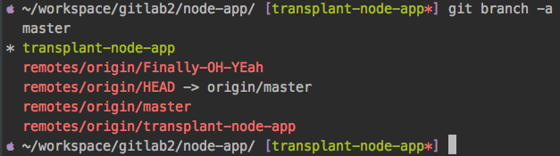

# 项目简介

  本项目在 [nvm] 安装的 [Nodejs8.12](https://nodejs.org/zh-cn/) 环境下开发, 语言 JavaScript [es6](http://es6.ruanyifeng.com)

> 使用框架

* 后台: [express4.16.4],
* 前端: [vue2.5], [vue-admin-template], [element-ui]

> 使用数据库

* [mongodb V4.0.2]
  * 使用 [mongoose] 进行 后台 与 数据库 的对接

> 开发部署

* 前端使用 [webpack-dev-server](https://github.com/webpack/webpack-dev-server) 进行打包发布
***
# 本地启动项目
1. mongodb 数据库使用验证的方式启动 或者 你可以使用在-> config/keys.js 修改链接 进行无验证 连接数据库

2. ```git clone https://github.com/quinnqin7/node-app.git```
  * 如果这个项目在分支的话,请,(不然直接跳到第3.)
  * ```cd node-app```
  * ```git branch -a``` #查看远程分支
  * ```git checkout -b transplant-node-app origin/transplant-node-app``` # 切换到本分支
  * 如果你是用 zsh 的话就会看到如下
  * 

3. ```cd node-app ; npm install; cd ../web; npm install``` (加载依赖)
4. 在 node-app项目根目录下 ```npm run dev``` (前端和后台一起启动)
5. 默认是在 localhost ,如果要修改  请全局 搜索 localhost 关键字 进行修改, 域名访问请修改 直接 改成域名 不要 用 公网 ip (不然访问首页会爆 [Invalid Host Header](https://tonghuashuo.github.io/blog/webpack-dev-server-invalid-host-header.html) 错误)
6. 最好使用 [pm2](http://pm2.keymetrics.io) 启动项目,而且是 前后端 分开 启动 ,不然 不知道 什么 时候 ,你 的 相关node 进程 就会莫名其妙的消失😁 ,至少我是这样
***
# 数据库模型


* 数据库模型文件 在 ```[projectroot]/modules/``` 里面
* 如果你想生成大量 测试数据 请查看 [README.md](./public/initdb/README.md)


***

# 重要模块说明
1.response token

    略略


2.router permission

    略略


### 模块视频日志

* [😄😭😄😭😄😭点这里😄😭😄😭😄😭](https://drive.google.com/drive/u/2/folders/1RMLnDFYNtceEsNZJoIPSxv5St6bhNf9-)

### 还需完成的模块

* 医师
  1.统计
* 企业
  1.统计
* 患者
  1.信息查看
  2.评价
* 超级管理员
  1.对医生企业的管理


***

### 现存问题

* 医生可以接受 同一段时间 内两个不同企业 的预约
* 还有很多,记不起来,碰到 在写


***
### 其他问题
    如果后台 异常了,没反应了,启动不了了
    mac:
    kill -15 `lsof -i tcp:3000 | grep node| awk '{print $2}'`
    linux:
    kill -15 `ps -ef | grep node| awk '{print $2}'`


    秦楠启动数据库
    mongod --dbpath ~/WebstormProjects/mongo --logpath ~/WebstormProjects/mongo/mongo.log --auth --fork


# 支持的浏览器

Modern browsers and Internet Explorer 10+.

| [](http://godban.github.io/browsers-support-badges/)</br>IE / Edge | [](http://godban.github.io/browsers-support-badges/)</br>Firefox | [](http://godban.github.io/browsers-support-badges/)</br>Chrome | [](http://godban.github.io/browsers-support-badges/)</br>Safari |
| --------- | --------- | --------- | --------- |
| IE10, IE11, Edge| last 2 versions| last 2 versions| last 2 versions


[vue-admin-template]:https://github.com/PanJiaChen/vue-admin-template/tree/master/src
[element-ui]:http://element-cn.eleme.io/#/zh-CN
[vue2.5]:https://cn.vuejs.org/index.html
[express4.16.4]:https://expressjs.com/zh-cn/
[mongodb V4.0.2]:https://www.mongodb.com
[mongoose]:https://mongoosejs.com
[nvm]:https://github.com/creationix/nvm

