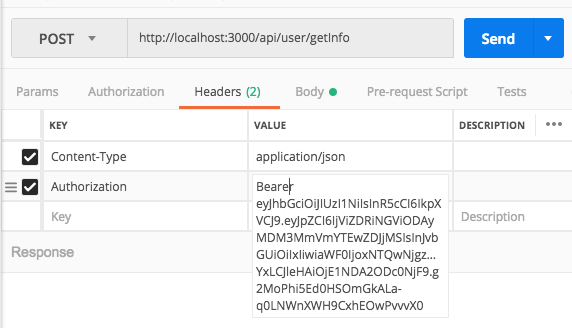

<div align=center></div>
# 项目简介

  本项目在 [nvm] 安装的 [Nodejs8.12](https://nodejs.org/zh-cn/) 环境下开发, 语言 JavaScript [es6](http://es6.ruanyifeng.com)

> 使用框架

* 后台: [express4.16.4],
* 前端: [vue2.5], [vue-admin-template], [element-ui]

> 使用数据库

* [mongodb V4.0.2]
  * 使用 [mongoose] 进行 后台 与 数据库 的对接

> 开发部署

* 前端使用 [webpack-dev-server](https://github.com/webpack/webpack-dev-server) 进行打包发布
***
# 本地启动项目
1. mongodb 数据库使用验证的方式启动 或者 你可以使用在-> config/keys.js 修改链接 进行无验证 连接数据库

2. ```git clone https://github.com/quinnqin7/node-app.git```
  * 如果这个项目在分支的话,请,(不然直接跳到第3.)
  * ```cd node-app```
  * ```git branch -a``` #查看远程分支
  * ```git checkout -b transplant-node-app origin/transplant-node-app``` # 切换到本分支
  * 如果你是用 zsh 的话就会看到如下
  * 

3. ```cd node-app ; npm install; cd ../web; npm install``` (加载依赖)
4. 在 node-app项目根目录下 ```npm run dev``` (前端和后台一起启动)
5. 默认是在 localhost:9898 , node 服务端口不变 ->3000, 如果要 修改前端 访问,请去 [projectname]/web/src/api/path.js 修改 host.ip , host.vueport, 域名访问请修改 直接 改成域名 不要 用 公网 ip (不然访问首页会爆 [Invalid Host Header](https://tonghuashuo.github.io/blog/webpack-dev-server-invalid-host-header.html) 错误)  非 root(管理员sudo组 用户无法使用1024以下端口,至少在 mac 上是这样的)
6. 最好使用 [pm2](http://pm2.keymetrics.io) 启动项目,而且是 前后端 分开 启动 ,不然 不知道 什么 时候 ,你 的 相关node 进程 就会莫名其妙的消失😁 ,至少我是这样
***
# 数据库模型


* 数据库模型文件 在 ```[projectroot]/modules/``` 里面
* 如果你想生成大量 测试数据 请查看 [README.md](./public/initdb/README.md)


***

# 重要模块说明
1.response token

    所有 对服务器数据的 请求都会 在 http 数据流的header 里边,
    添加一个 Authorization key 里面放着 服务器 返回的 jwt 编码后的 token


    另外 返回的数据 都会先经过 axios 过滤拦截, 可以针对特殊场景根据自己的需要进行特定修改拦截
    并且所有 前端 api 引入,都需要使用该 实例,然后该实例 导出(export) 一个 Promise 对象 ,
    可以对数据请求 的 成功 和 失败进行不同 的处理,
    具体例子请看 web/views/login/index.vue 里边的 handleLogin methods 一直看下去

```javascript
import axios from 'axios'
import { Message, MessageBox } from 'element-ui'
import store from '../store'
import { getToken } from '@/utils/auth'

// 创建axios实例
const service = axios.create({
  baseURL: process.env.BASE_API, // api 的 base_url
  timeout: 5000 // 请求超时时间
})

// request拦截器
service.interceptors.request.use(
  config => {
    if (store.getters.token) {
      config.headers['Authorization'] = "Bearer "+getToken() // 让每个请求携带自定义token 请根据实际情况自行修改
    }
    return config
  },
  error => {
    // Do something with request error
    console.log(error) // for debug
    Promise.reject(error)
  }
)

// response 拦截器
service.interceptors.response.use(
  response => {
    /**
     * code为非20000是抛错 可结合自己业务进行修改
     */
    const res = response.data
    if (res.code !== 20000) {
      Message({
        message: res.message,
        type: 'error',
        duration: 5 * 1000
      })
      // 50008:非法的token; 50012:其他客户端登录了;  50014:Token 过期了;
      if (res.code === 50008 || res.code === 50012 || res.code === 50014) {
        MessageBox.confirm(
          '你已被登出，可以取消继续留在该页面，或者重新登录',
          '确定登出',
          {
            confirmButtonText: '重新登录',
            cancelButtonText: '取消',
            type: 'warning'
          }
        ).then(() => {
          store.dispatch('FedLogOut').then(() => {
            location.reload() // 为了重新实例化vue-router对象 避免bug
          })
        })
      }
      return Promise.reject('error')
    } else {
      return response.data
    }
  },
  error => {
    console.log('err' + error) // for debug
    Message({
      message: error.message,
      type: 'error',
      duration: 5 * 1000
    })
    return Promise.reject(error)
  }
)

export default service
```

2.router permission

    本应用 一共应该会有 4种角色 ,不同的角色 分不同的菜单
    一共 有三个 文件在 管理这个 角色判断
    web/src/permission.js (在这边 进行路由 判断)
    web/store/permission.js (根据 角色 roles 动态生成 路由,子路由,子子路由)
    web/router/index.js (存放 动态路由的 地方)

>web/store/permission.js
```javascript
import { asyncRouterMap, constantRouterMap } from '../router';
import store from './index'
function hasPermission(roles, route) {
    if (route.meta && route.meta.role) {
        return roles.some(role => route.meta.role.indexOf(role) >= 0)
    } else {
        return true
    }
}

const permission = {
    state: {
        routers: constantRouterMap,
        addRouters: []
    },
    mutations: {
        SET_ROUTERS: (state, routers) => {
            state.addRouters = routers;
            state.routers = constantRouterMap.concat(routers);
        }
    },
    actions: {
        GenerateRoutes({ commit },data) {
            return new Promise(resolve => {
                const {roles} = data;
                //console.log(roles)
                const accessedRouters = asyncRouterMap.filter(v => {
                    //if you want to set admin role in the system you can tkof //and set the res-> roles:['admin']
                    //if (roles.indexOf('admin') >= 0) return true;
                    //这边注释掉 是因为 , 超级管理员会拥有所有 路由 ,但现实 是 根本 不需要,还是 在新建一个角色 然后 ,写不同的服务端
                    if (hasPermission(roles, v)) {
                        if (v.children && v.children.length > 0) {
                            v.children = v.children.filter(child => {
                                if (hasPermission(roles, child)) {
                                    return child
                                }
                                return false;
                            });
                            return v
                        } else {
                            return v
                        }
                    }
                    return false;
                });
                commit('SET_ROUTERS', accessedRouters);
                resolve();
            })
        }
    }
};
export default permission;

```
    这里边 使用 了一个 递归 进行 子路由以及 子子子...路由的添加


### 模块视频日志

* [😄😭😄😭😄😭点这里😄😭😄😭😄😭](https://drive.google.com/drive/u/2/folders/1RMLnDFYNtceEsNZJoIPSxv5St6bhNf9-)

### 还需完成的模块

* 医师
  1.统计
* 企业
  1.统计
* 患者
  1.信息查看
  2.评价
* 超级管理员
  1.对医生企业的管理
* 所有的表格都没有进行 多项查询  , ~~分页处理~~
* 所有 的时间 格式, 以及 时间 比较 ,时间 排列 都没完成
* 国际化 功能 没翻译 -> tw.js ->en.js
* 预约时间过期的判断 以及 服务企业时间过期的 判断
* 地图
* 还有很多,记不起来,碰到想到 在写 🌶

***

### 现存问题
* 暂时 将 管理员 的信息 注册到 Doctor 表中,不然 登不进去(在管理员注册时,请选择 医生,然后 在数据库中 更改 管理员的 角色值,相关文件 Router/api/user.js-> /getInfo)
* 返回错误 提示 需要 友好 化
* 如果用户填写的是 一个❎的邮箱 ,那么邮箱不会 发送成功,  需要在 医生端添加 一项 ,是否开启 邮箱验证的 选项
* 医师(已签到 然后 去问诊)  请求 企业的时候 数据 验证(妈的 好多 这种 验证,不改了,谁遇到谁倒霉)
* 医生可以接受 同一段时间 内两个不同企业 的预约
* 还有很多,记不起来,碰到想到 在写 🌶

### 待优化的小问题 哇=͟͟͞͞塞=͟͟͞͞=͟͟͞͞风=͟͟͞͞好=͟͟͞͞大=͟͟͞͞啊=͟͟͞͞
*企业端 患者模块
    1.点开弹窗无法获取到患者性别
    2.修改患者资料失败
    3.搜索功能
*医师端
    头像上传功能。并且使之能在企业端的预约模块中显示。

*所有表单样式的优化
*登录界面的优化及错误提示
*首页模板样式的优化（建议把颜色改为浅色，简洁为主）


***
### 其他问题
    如果后台 异常了,没反应了,启动不了了
    mac:
    kill -15 `lsof -i tcp:3000 | grep node| awk '{print $2}'`
    linux:
    kill -15 `ps -ef | grep node| awk '{print $2}'`


    启动数据库
    mongod --dbpath ~/WebstormProjects/mongo --logpath ~/WebstormProjects/mongo/mongo.log --auth --fork


# API
    (使用 postman进行 api 数据测试,以下是测试过程的 api 分享,并且body 里边 都有 数据请 求格式 还存在)
[](https://app.getpostman.com/run-collection/afc4520ba3f8e6891f20)

# 第三方 API
* 百度地图JavaScript API V2.0
    1.[相关介绍](http://lbsyun.baidu.com/index.php?title=jspopular)
    2.[类参考](http://lbsyun.baidu.com/cms/jsapi/reference/jsapi_reference.html)
* 将来有可能换到 google map (台湾地区百度地图无法 使用地址 逆解析)


# 支持的浏览器

Modern browsers and Internet Explorer 10+.

| [](http://godban.github.io/browsers-support-badges/)</br>IE / Edge | [](http://godban.github.io/browsers-support-badges/)</br>Firefox | [](http://godban.github.io/browsers-support-badges/)</br>Chrome | [](http://godban.github.io/browsers-support-badges/)</br>Safari |
| --------- | --------- | --------- | --------- |
| IE10, IE11, Edge| last 2 versions| last 2 versions| last 2 versions


[vue-admin-template]:https://github.com/PanJiaChen/vue-admin-template/tree/master/src
[element-ui]:http://element-cn.eleme.io/#/zh-CN
[vue2.5]:https://cn.vuejs.org/index.html
[express4.16.4]:https://expressjs.com/zh-cn/
[mongodb V4.0.2]:https://www.mongodb.com
[mongoose]:https://mongoosejs.com
[nvm]:https://github.com/creationix/nvm

